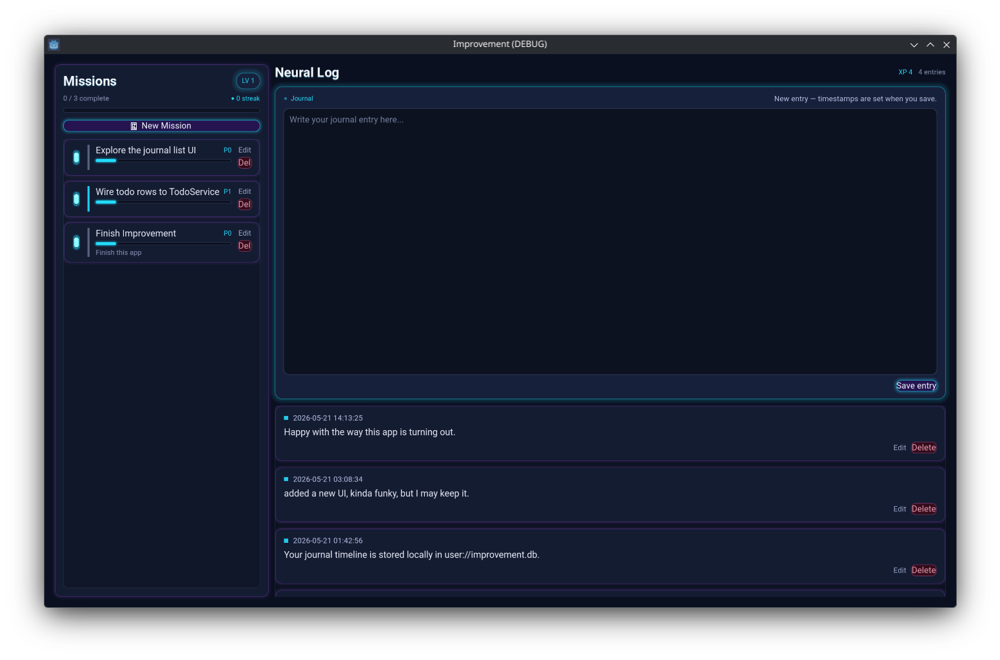

# Improvement

A journalling app for self improvement, knowledge enhancement, and staying focused on the tasks that matter.

Built with Godot **4.7** — readable typography, a scrollable journal timeline, a task sidebar, Pomodoro timers, and local SQLite storage in a folder you choose (e.g. Dropbox).



**Architecture:** [docs/architecture.md](docs/architecture.md) · **Data model:** [docs/data-model.md](docs/data-model.md)

## Status

Desktop prototype with **SQLite-backed** journal and tasks, inline editing, and Pomodoro work tracking on the task list.

| Area | Status |
|------|--------|
| Split journal / task layout | Shipped |
| Journal timeline + inline composer | Shipped |
| Task list + inline task editor | Shipped |
| Drag reorder, done checkbox, row edit/delete | Shipped |
| First-run DB folder setup (e.g. Dropbox) | Shipped |
| Theme + Roboto | Shipped |
| UI scale | Defaults to **system detection**; override in **Settings** (gear icon) |
| SQLite schema + migrations (v4; tags) | Shipped |
| `JournalService` / `TaskService` / `PomodoroService` | Shipped |
| Pomodoro → task `in_progress` + work time on rows | Shipped |
| Window size/position persistence (desktop export) | Shipped |
| Settings screen | Shipped |
| Encryption at rest | Not scheduled — see [recommendations](docs/architecture.md#recommendations-not-on-roadmap) |
| Cloud sync / backup UX | Planned (roadmap) |

## Current app (what ships today)

- **Two-pane shell:** journal (left), tasks (right), resizable split, global theme.
- **Journal:** scrollable entry rows; **+ New Journal Entry** opens an inline composer; edit/delete per row; Pomodoro on the composer when editing.
- **Tasks:** scrollable rows with priority strip, progress bar, **work time** label (from Pomodoros), and checkbox; **+ New Task** opens an inline task panel; drag to reorder; Pomodoro on the **top** task in the list.
- **Data:** `improvement.db` in a folder you pick at first run; path stored in `user://app_config.json` (Godot user data).
- **Empty first run** — no sample journal entries or tasks.
- **Export:** Windows Desktop preset → [`export_presets.cfg`](export_presets.cfg) (`Applications/Improvement/` on this machine).

## Requirements

- [Godot Engine **4.7.x**](https://godotengine.org/download) (project `config/features` includes `4.7`; developed with 4.7 beta and 4.6.x).
- **Desktop** (Linux, macOS, or Windows). Mobile feature tag is present for future export; UI is desktop-first.
- **godot-sqlite** under [`addons/godot-sqlite/`](addons/godot-sqlite/); SQL only via the [`Database`](scripts/autoload/database.gd) autoload from services.

## Getting started

1. Clone the repo and open the folder in Godot (**Project → Import** if needed), then [`project.godot`](project.godot).
2. **Main scene:** **Project → Project Settings → Application → Run → Main Scene** → [`res://scenes/main.tscn`](scenes/main.tscn).
3. Press **F5**. On first run, the **setup overlay** asks for a folder; `improvement.db` is created there.

**Reset setup (testing):** `godot --path . --headless -s res://scripts/tools/reset_app_data.gd` — or delete `%APPDATA%\Godot\app_userdata\Improvement\`.

**Export (Windows debug):** Godot **Project → Export → Windows Desktop**, or:

```text
Godot_v4.7-beta3_win64.exe --headless --path <repo> --export-debug "Windows Desktop" C:\Users\<you>\Applications\Improvement\Improvement.exe
```

### Resizable game window (editor)

Godot often embeds the game in the editor. Use the **Game** tab → disable **Embed Game on Next Play**, or **Editor Settings → Run → Window Placement → Game Embed Mode → Disabled**, then **F5**.

### UI scale

Runtime scale defaults to **system detection** via [`scripts/ui/ui_scale_detector.gd`](scripts/ui/ui_scale_detector.gd), applied in [`scenes/main.gd`](scenes/main.gd). A Settings control for `app_settings.ui_scale` is on the [roadmap](#roadmap).

## Project structure

```
improvement/
├── project.godot
├── export_presets.cfg
├── scenes/
│   ├── main.tscn / main.gd
│   ├── journal/journal_entry_row.tscn
│   ├── tasks/task_row.tscn
│   ├── setup/initial_setup_dialog.tscn
│   ├── ui/pomodoro_timer.tscn
├── scripts/
│   ├── app/app_config.gd
│   ├── autoload/          # AppSetup, Database, WindowLayout, services
│   ├── database/
│   ├── models/
│   └── tools/             # reset_app_data.gd, capture_screenshot.gd
├── assets/{fonts,themes,icons,textures}/
├── addons/godot-sqlite/
└── docs/
```

## Development notes

- **Main scene UID:** `uid://d4bhhy4ln2jhd` — keep stable if renaming run scene.
- **Data access:** UI → `JournalService` / `TaskService` / `PomodoroService`; not raw SQL in scenes.
- **Bootstrap:** `AppConfig` (`user://app_config.json`) before `Database` opens; see [data model](docs/data-model.md).
- **Debug run:** prints journal/task counts after DB init.
- **Rendering:** `mobile` renderer; Windows uses D3D12 driver in `project.godot`.

## Roadmap

### Next (engineering hardening)

1. ~~**Database open failure**~~ — retry dialog when SQLite cannot open; services no longer hang on `ready_changed`.
2. ~~**User-visible save errors**~~ — failed saves/deletes show a dialog with the database error detail.
3. ~~Remove unused task item dialog~~ — done; inline task composer is canonical.

### Done

4. ~~SQLite schema + services~~ ([data model](docs/data-model.md)).
5. ~~Journal and task UI bound to services~~.

### Later

6. ~~**User preferences UI**~~ — Settings dialog: journal sort, **UI scale** (manual or system), applies immediately.
7. **Optional sync / backup** — Dropbox / iCloud or explicit export/import beyond placing `improvement.db` in a synced folder.
8. **Swap panel while editing entries** — switch between the journal composer and task editor without losing unsaved text (e.g. keep drafts, or prompt to save/discard before changing focus).

Pomodoro and encryption are **not** on the roadmap; see [recommendations](docs/architecture.md#recommendations-not-on-roadmap) in the architecture doc.

## Third-party licenses

| Component | Location | License |
|-----------|----------|---------|
| [Godot SQLite](https://github.com/godot-sqlite/godot-sqlite) | [`addons/godot-sqlite/`](addons/godot-sqlite/) | [MIT](addons/godot-sqlite/LICENSE.md) |
| Roboto font | [`assets/fonts/`](assets/fonts/) | [Apache License 2.0](https://fonts.google.com/specimen/Roboto/license) (Google Fonts) |

## License

**Improvement** (application code and original assets in this repository, excluding third-party components listed above) is licensed under the [MIT License](LICENSE).

Copyright (c) 2026 David Graham
