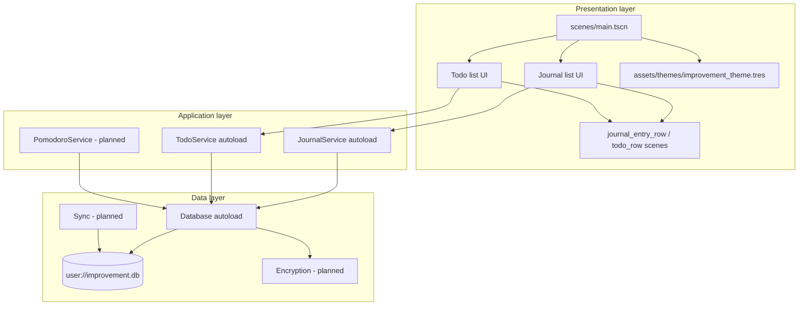

# Improvement — Architecture

This document describes the intended architecture for **Improvement**, a productivity app built with **Godot 4.6**. It reflects decisions made during early design and prototyping, the **current implementation**, and the **target system**. Sections marked **Open** list choices not yet finalized.

See also: [README](../README.md) (setup, status, roadmap) · [Data model](data-model.md) · [SQL schema](schema.sql)

---

## Goals and constraints

| Goal | Architectural implication |
|------|---------------------------|
| Readable, low-friction UI | Global theme, large base font (20px+), optional UI scale, generous margins |
| Journal as a **timeline** | Scrollable list; default **newest-first** (`app_settings`) |
| Focused **task list** | Separate pane; optional `journal_entry_id` FK on todos |
| Local-first data | SQLite `user://improvement.db` via **godot-sqlite**; services autoload |
| Privacy later | Encryption at rest (approach TBD) |
| Optional cloud | Sync/export behind explicit user action (provider TBD) |
| Pomodoro | Timer service tied to “active” journal entry or task (behavior TBD) |

**Non-goals (for now):** 3D, physics, multiplayer, real-time collaboration.

---

## High-level view



**Dependency rule:** UI scenes talk to application services (or autoloads), not to raw SQL. The **godot-sqlite** addon is confined to the data layer.

---

## Current implementation (shipped)

### Runtime entry

- **Engine:** Godot 4.6.x  
- **Main scene:** `res://scenes/main.tscn` (`uid://d4bhhy4ln2jhd`)  
- **Root script:** `scenes/main.gd` — applies `content_scale_factor` at **1.0** (constant until Settings UI)

### UI scene tree (today)

```
Main (Control, theme)
└── MarginContainer (full rect)
	└── HSplitContainer (split_offset ≈ 600)
		├── JournalScrollContainer
		│   └── VBoxContainer          # empty — rows not yet instanced
		└── ToDoScrollContainer
			└── VBoxContainer          # empty
```

### Presentation choices already made

| Decision | Choice |
|----------|--------|
| UI toolkit | Godot **Control** nodes (not 3D / not immediate-mode custom draw) |
| Layout root | **Control** with full-window anchors |
| Journal / todo separation | **HSplitContainer** — two columns, user-resizable split |
| Scrollable lists | **ScrollContainer → VBoxContainer → row scenes** (not `ItemList` for multi-line body text) |
| Text in rows | **Label** with `autowrap_mode = WORD_SMART` for read-only previews; **TextEdit** for edit surfaces when added |
| Typography | **Theme** resource + **Roboto**; `default_font_size = 20` in `improvement_theme.tres` |
| UI scale | `content_scale_factor` **1.0** on root; **TODO:** Settings reads/writes `app_settings.ui_scale` |
| Assets layout | `assets/{fonts,themes,icons}`, `scenes/`, `addons/` |

### Data layer (shipped)

- **godot-sqlite** via `Database` autoload: opens `<chosen_folder>/improvement.db` (path from first-run setup → `user://app_config.json`), `PRAGMA user_version` up to 3.
- Tables: `journal_entries`, `todos`, `pomodoro_sessions`, `app_settings` — see [data-model.md](data-model.md).
- **JournalService** / **TodoService** autoloads: CRUD, soft delete, signals, `LIKE` search (journal).
- **Resource** models: `JournalEntry`, `TodoItem`, `PomodoroSession`; `DbRow` for nullable SQLite fields.
- **UI:** `main.gd` lists rows from services; dialogs for create/edit; soft delete from rows.
- First run starts with an empty journal and todo list (no sample rows).
- **Not yet:** encryption; sync; Pomodoro UI; FTS5; settings UI.

---

## Target UI architecture

### Main shell (`scenes/main.tscn`)

Stays the **composition root**: split layout, theme, window resize via anchors + container `size_flags`. Should **not** accumulate business logic; delegate to child controllers or autoloads.

**Layout rules (agreed):**

- `Main` / `MarginContainer`: anchor full rect.  
- Each `ScrollContainer` in the split: expand **horizontal and vertical**.  
- Scroll child `VBoxContainer`: expand **horizontal**, **shrink** vertical (content-driven height).  
- Each row: `PanelContainer` → `Label`(s) with horizontal expand + word wrap.  
- Avoid tiny `custom_minimum_size` on labels; use expand fill for wrap width.

### Row scenes (planned)

| Scene | Purpose |
|-------|---------|
| `scenes/journal/journal_entry_row.tscn` | One timeline row: timestamps + body preview |
| `scenes/todos/todo_row.tscn` | One task row: checkbox, title, optional metadata |

**Population pattern:**

```gdscript
# Pseudocode — journal list refresh
for child in journal_vbox.get_children():
	child.queue_free()
for entry in journal_service.get_entries(page):
	var row = journal_row_scene.instantiate()
	row.setup(entry)
	journal_vbox.add_child(row)
```

**Infinite / long timelines:**

- **Phase 1:** Load all rows (or a large page) into `VBoxContainer` — acceptable for personal journal scale.  
- **Phase 2 (optional):** On scroll near bottom, append older pages (pagination).  
- **Phase 3 (optional):** Virtualized rows only if profiling shows need — **Open** decision.

### Editing model (**Open**)

Options not yet chosen:

- **A.** List = preview only; full edit in detail pane or modal.  
- **B.** Inline `TextEdit` per row.  
- **C.** Master–detail: select row → edit in right sub-pane (would reshape split layout).

### Theme and settings (planned)

- **Theme** remains the single source for font sizes, colors, margins.  
- **Settings autoload** should own UI scale, font step, contrast — persist to disk (format **Open**).  
- **TODO:** Settings screen slider (or similar) for `ui_scale` → `content_scale_factor` on root.

---

## Data architecture

Full detail: **[data-model.md](data-model.md)** and **[schema.sql](schema.sql)**.

### Decisions (v1)

| Topic | Decision |
|-------|----------|
| Storage | Single SQLite file in a user-chosen folder (setup dialog; config in `user://app_config.json`) |
| Settings | `app_settings` key/value table (not `settings.cfg`) |
| Timestamps | Unix UTC seconds (`INTEGER`) |
| Deletes | Soft delete (`deleted_at`) on journal and todos |
| Journal order | Newest-first by default; setting `journal_sort_newest_first` |
| Todo order | `sort_order` then `created_at` |
| Todo ↔ journal | Optional FK `todos.journal_entry_id` |
| Domain models | `Resource` classes with `from_row()` |
| SQL access | `Database` autoload only; UI uses **JournalService** / **TodoService** |
| Search v1 | `LIKE` on body; FTS5 later |
| Migrations | `PRAGMA user_version`; v1 bootstrap in `Database._migrate_to_v1()` |
| godot-sqlite | `SQLite.new()`, `foreign_keys = true`, `query_with_bindings` for writes |

### Encryption (**Open**)

Requirements from README; mechanism not chosen:

- SQLCipher-compatible extension vs application-level encrypt-before-store.  
- Key derivation (password vs OS keyring).  
- Whether encrypted DB is one file or encrypted blobs in SQLite.

### Sync (**Open**)

Requirements: Dropbox / iCloud. Architectural options:

- **Export/import** of encrypted DB or JSON bundle (simplest).  
- **File-level** sync of `user://improvement.db` with conflict detection.  
- **Provider SDKs** per platform (higher cost).  

Conflict policy (last-write-wins vs merge) — **Open**.

---

## Application layer

### Autoloads

| Autoload | Status | Responsibility |
|----------|--------|----------------|
| `AppSetup` | Shipped | First-run dialog: choose folder for `improvement.db` (e.g. Dropbox) |
| `Database` | Shipped | SQLite, migrations, repository SQL, `app_settings` |
| `JournalService` | Shipped | Journal CRUD, search, sort preference, signals |
| `TodoService` | Shipped | Todo CRUD, status, signals |
| `PomodoroService` | Planned | Timer UX; DB insert/complete exists on `Database` |
| `Settings` | Partial | Keys in DB; dedicated autoload optional later |

UI refresh: connect to `JournalService.entry_*` and `TodoService.todo_*` signals to rebuild scroll lists.

### Pomodoro (**Open**)

- Global floating timer vs inline per row.  
- One active session at a time vs multiple.  
- Persist sessions to DB or ephemeral only.

---

## Cross-cutting concerns

### Display and readability

- Large fonts via theme; optional `content_scale_factor`.  
- High contrast theme variant — **Open**.  
- Keyboard navigation between panes and rows — **Open**.  
- Reduced motion / minimal animations — **Open**.

### Platform

- **Development:** desktop (Linux primary).  
- **Export tag:** Mobile present in `project.godot`; treat as **future** unless UI is validated on small screens.  
- **Rendering:** `mobile` renderer for lightweight UI; revisit for desktop-only polish — **Open**.

### Observability

- `print` in `main.gd` today; replace with optional debug logging autoload or strip in release — **Open**.

---

## Repository layout

### Today

```
improvement/
├── docs/
│   ├── architecture.md
│   ├── data-model.md
│   └── schema.sql
├── scenes/
│   ├── main.tscn
│   └── main.gd
├── scripts/
│   ├── autoload/
│   │   ├── database.gd
│   │   ├── journal_service.gd
│   │   └── todo_service.gd
│   ├── database/
│   │   └── db_constants.gd
│   └── models/
│       ├── journal_entry.gd
│       ├── todo_item.gd
│       └── pomodoro_session.gd
├── assets/{fonts,themes,icons}/
├── addons/godot-sqlite/
├── project.godot
├── README.md
└── LICENSE
```

### Next (UI)

```
scenes/journal/journal_entry_row.tscn
scenes/todos/todo_row.tscn
```

Wire rows to `JournalService.list_entries()` / `TodoService.list_todos()`.

---

## Implementation phases

| Phase | Deliverable |
|-------|-------------|
| **0** | Split UI shell, theme, scale |
| **1** | Database + schema v1 + Journal/Todo services + models — **done** |
| **2** | Journal/todo row scenes + UI bound to services — **done** |
| **3** | Settings UI; layout flags; **TODO:** user-adjustable UI scale via `app_settings.ui_scale` |
| **4** | Pomodoro service + UI |
| **5** | Encryption at rest |
| **6** | Backup / sync provider |

---

## Open decisions

Decisions below should be resolved before or during the corresponding phase. Owner: product / implementer.

### Product and UX

1. **Journal sort order** — newest-first (feed) vs oldest-first (diary)?  
2. **Journal editing UX** — preview list + detail pane vs inline edit vs modal?  
3. **Journal entry fields** — tags? attachments? (body + timestamps shipped)  
4. **Todo model** — statuses (todo/doing/done), priority, due date, projects/contexts?  
5. **Link tasks to journal entries** — yes/no, optional FK?  
6. **Pomodoro UX** — one global timer; attach to entry/task how?  
7. **Empty states** — copy and actions for first-run journal/todos?

### UI technical

8. **Pagination** — load-all vs scroll-end fetch for journal history?  
9. **Virtualization** — needed or YAGNI for expected entry count?  
10. **Section headers** — “Journal” / “Todos” labels in shell?  
11. **Dark / high-contrast theme** — ship v1 or later?  
12. **Mobile layout** — second column collapses to tabs?

### Data and security

13. ~~SQLite schema~~ — **Resolved** (v1, see [data-model.md](data-model.md)).  
14. ~~Search v1~~ — **Resolved:** `LIKE`; FTS5 later.  
15. ~~Settings storage~~ — **Resolved:** `app_settings` table.  
16. **Encryption** — mechanism, key storage, migration from plain DB?  
17. **Backup format** — raw DB, encrypted DB, JSON export?  
18. **Sync** — Dropbox vs iCloud vs export-only; conflict resolution?

### Code structure

19. ~~Domain models~~ — **Resolved:** `Resource` + `from_row()`.  
20. ~~Autoload names~~ — **Resolved:** `Database`, `JournalService`, `TodoService`.  
21. **Signals vs direct calls** — services emit signals; UI controllers subscribe — **convention set**, refine per scene.  
22. **Main.gd responsibility** — shell + fixed UI scale 1.0 until Settings applies `ui_scale` from DB; list logic stays out of `main.gd`.

### Platform and release

24. **Desktop-first vs mobile-first** — drives layout and export presets?  
25. **Renderer** — keep `mobile` or switch for desktop targets?  
26. **Remove unused project features** — Jolt physics, Mobile tag until needed?

---

## References

- [Godot UI layout (containers, size flags)](https://docs.godotengine.org/en/4.6/tutorials/ui/size_and_anchors.html)  
- [godot-sqlite addon](https://github.com/godot-sqlite/godot-sqlite)  
- [Game embedding / run window](https://docs.godotengine.org/en/4.6/tutorials/editor/game_embedding.html) (editor-only; not app architecture)

---

*Last updated: data layer v1 (godot-sqlite, services, schema).*
