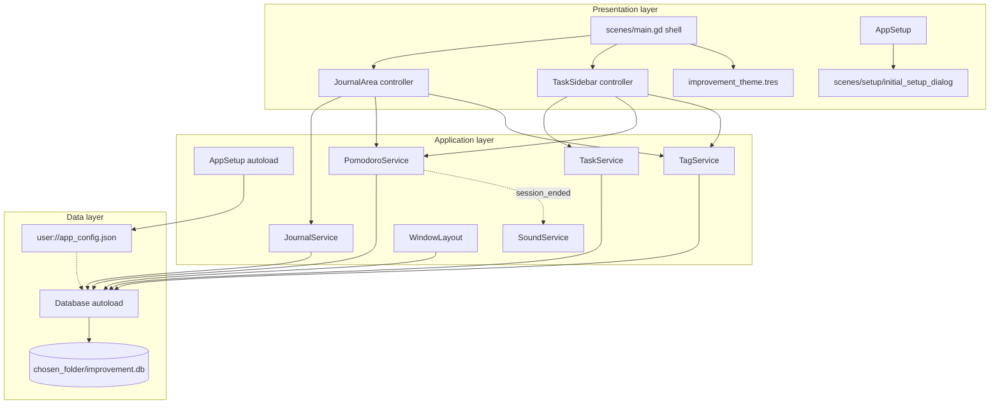

# Improvement — Architecture

Architecture for **Improvement**, a desktop productivity app on **Godot 4.7**. This document describes **what ships today**, the **target direction**, and **open** choices.

See also: [README](../README.md) · [Data model](data-model.md) · [SQL schema](schema.sql)

---

## Goals and constraints

| Goal | Architectural implication |
|------|---------------------------|
| Readable, low-friction UI | Global theme, Roboto, UI scale defaults to system detection; optional stored override (`app_settings.ui_scale`) |
| Journal as a **timeline** | Scrollable rows, newest-first default (`app_settings`) |
| Focused **task list** | Right pane; manual `sort_order`; optional `journal_entry_id` FK |
| Local-first data | SQLite `<chosen_folder>/improvement.db`; bootstrap in `user://app_config.json` |
| Pomodoro discipline | One active timer; sessions in DB; task work time in UI |
| Privacy later | Encryption at rest — not scheduled ([recommendations](#recommendations-not-on-roadmap)) |
| Optional cloud | Backup export/import shipped (Settings); cloud sync via folder choice (e.g. Dropbox) |

**Non-goals (for now):** 3D, physics, multiplayer, real-time collaboration.

---

## High-level view



**Dependency rule:** UI calls **services** (or setup/bootstrap), not raw SQL. **godot-sqlite** stays inside `Database`.

---

## Current implementation (shipped)

### Runtime entry

- **Engine:** Godot **4.7** (`project.godot`).
- **Main scene:** `res://scenes/main.tscn` (`uid://d4bhhy4ln2jhd`).
- **Root script:** `scenes/main.gd` — shell, UI scale, pomodoro cross-panel refresh; `content_scale_factor = 1.0`.
- **Journal controller:** `scenes/journal/journal_area.gd` on `JournalArea` — timeline, composer, header stats.
- **Task controller:** `scenes/tasks/task_sidebar.gd` on `TaskSidebar` — list, task composer, progress, top-task pomodoro.

### First run

1. `AppSetup` shows `initial_setup_dialog` (themed `CanvasLayer`) if `app_config.json` has no `db_directory`.
2. User picks a folder (default suggestion: `~/Dropbox/Improvement` on Windows).
3. `Database` opens `<folder>/improvement.db`, runs migrations (v1–v3), applies defaults, **no seed rows**.

### UI shell (today)

```
Main (Control, theme)
├── Background (gradient TextureRect)
└── MarginContainer
	└── HSplitContainer
		├── JournalArea (VBox)
		│   ├── Header (title, XP/entry placeholders)
		│   ├── NewJournalButton
		│   └── JournalSplit (VSplit)
		│       ├── ComposerPanel (inline TextEdit + Pomodoro)
		│       └── JournalScroll → journal_entry_row instances
		└── TaskSidebar (Panel)
			├── Header, progress, NewTaskButton
			└── TaskSplit (VSplit)
				├── TaskComposerPanel (inline edit + status)
				└── TaskScroll → task_row instances
```

### Row scenes (shipped)

| Scene | Role |
|-------|------|
| `scenes/journal/journal_entry_row.tscn` | Timestamps + body preview; edit |
| `scenes/tasks/task_row.tscn` | Active LED, title, notes, priority strip, **work time**, progress bar, **Done** / **Edit**, drag handle |
| `scenes/ui/pomodoro_timer.tscn` | Start/pause/stop; bound to journal or task target |
| `scenes/setup/initial_setup_dialog.tscn` | DB folder picker + `FileDialog` |

### Editing model (current)

- **Journal:** list is read-only preview; **create/edit** in the **composer** panel above the list.
- **Tasks:** list rows are read-only summary with **Done** and **Edit**; full editing in the **task panel**.

### Presentation choices

| Decision | Choice |
|----------|--------|
| UI toolkit | Godot **Control** + theme |
| Lists | `ScrollContainer` → `VBoxContainer` → row `PanelContainer`s |
| Typography | Roboto via `improvement_theme.tres` |
| UI scale | Defaults to system detection; override via Settings → `app_settings.ui_scale` (applies immediately) |
| Task metadata | Priority strip (0–3); **work time** from aggregated Pomodoros (not `P0` label) |

### Data layer (shipped)

- **Bootstrap:** [`scripts/app/app_config.gd`](../scripts/app/app_config.gd) → `user://app_config.json`.
- **Database:** [`scripts/autoload/database.gd`](../scripts/autoload/database.gd) — `PRAGMA user_version` **6**; tables per [data-model.md](data-model.md).
- **Services:** `JournalService`, `TaskService`, `TagService`, `PomodoroService`, `SoundService`.
- **WindowLayout:** persists window bounds to `app_settings` on desktop export.
- **Search:** journal `LIKE` on body (FTS5 deferred).

### Pomodoro (shipped behavior)

- **One** active session (`PomodoroService`); widgets on journal composer and **top task** only.
- `start_for(task)` on a **pending** task → `TaskService.set_status(..., in_progress)`.
- Sessions → `pomodoro_sessions`; on end, `session_ended` refreshes row work stats.
- **Completed pomodoros:** `completed = 1`. **Work time:** sum of `(ended_at - started_at)` for ended sessions.
- UI: `TimeFormat.format_work_duration()` on row; tooltip = pomodoro count.

---

## Application layer

### Autoloads

| Autoload | Responsibility |
|----------|----------------|
| `AppSetup` | First-run folder dialog; emits `setup_completed` |
| `Database` | SQLite, migrations, SQL, `app_settings` |
| `WindowLayout` | Save/restore window size and position |
| `JournalService` | Journal CRUD, search, sort preference, signals |
| `TaskService` | Task CRUD, reorder, `get_work_stats*`, signals |
| `TagService` | Tag catalog + entry/task assignments; `entry_tags_changed`, `task_tags_changed` |
| `PomodoroService` | Timer state, persistence, `in_progress` promotion, `session_ended`, daily work stats |
| `SoundService` | Plays feedback sound on completed pomodoro (`session_ended` listener) |

UI rebuilds lists on service signals; task work stats refresh on `session_ended` without full list reload.

---

## Data architecture

| Topic | Decision |
|-------|----------|
| Storage | Single `improvement.db` in user-chosen directory |
| Bootstrap | `user://app_config.json` (`db_directory`) |
| Settings in DB | `app_settings` key/value |
| Timestamps | Unix UTC seconds |
| Deletes | Soft delete on journal and tasks |
| SQL access | `Database` only from services |

Details: [data-model.md](data-model.md), [schema.sql](schema.sql).

---

## Implementation phases

| Phase | Deliverable | Status |
|-------|-------------|--------|
| **Next-1** | DB open failure UX (no hang on `ready_changed`) | **Done** |
| **Next-2** | User-visible save/API errors | **Done** |
| **Next-3** | ~~Remove unused task item dialog~~ | **Done** |
| **0** | Split shell, theme, scale | **Done** |
| **1** | Database v1–v3 + services + models | **Done** |
| **2** | Row scenes + lists + inline editors | **Done** |
| **2b** | First-run setup + empty DB | **Done** |
| **2c** | Pomodoro + task work stats | **Done** (top task + journal only) |
| **3** | Settings UI + `ui_scale` slider | **Done** |
| **6** | Sync / backup UX | **Done** |
| **8** | Swap panel while editing entries (journal ↔ task without losing drafts) | **Done** |
| — | Encryption | **Shelved** (see recommendations) |
| — | Pomodoro per-row / polish | **Not on roadmap** (see recommendations) |

---

## Recommendations (not on roadmap)

These are sensible next investments **after** roadmap items **3** and **6**, or in parallel if priorities change. They are documented here instead of the README roadmap so the current app stays the baseline.

### Pomodoro (former roadmap item 4)

**Current state is enough for a focused workflow:** one timer, top task + journal, automatic `in_progress`, honest work-time display.

| Option | Effort | Value |
|--------|--------|--------|
| **A. Keep as-is** | None | Matches “one thing at a time”; least UI noise |
| **B. Per-row Pomodoro buttons** | Medium | Start timer on any task without reordering; still one global session |
| **C. “Focus task” pin** | Low–medium | Star/pin one task for the header timer regardless of sort order |
| **D. Session history panel** | Medium | List past Pomodoros for a task (read-only); good for review |
| **E. Configurable duration / breaks** | Medium | Store duration in `app_settings`; short/long presets |

**Recommendation:** **A** until Settings (roadmap **3**) ships, then **C** if reordering tasks is annoying, then **B** if you routinely work on non-top tasks. Defer **E** until daily use shows 25 minutes is wrong.

### Encryption (former roadmap item 5)

**Current state:** plain SQLite on disk (Dropbox sync = file is visible to Dropbox and any machine with folder access).

| Option | Effort | Tradeoff |
|--------|--------|----------|
| **SQLCipher** (encrypted SQLite file) | High | Best “one file” story; godot-sqlite may need a build that supports it |
| **App-level encrypt-before-write** | High | Works with any SQLite; complex for search and migrations |
| **OS full-disk encryption only** | None (user) | No app change; does not protect Dropbox copies |
| **Export encrypted backup** | Medium | Manual backup flow; DB stays plain at runtime (pairs well with roadmap **6**) |

**Recommendation:** Do **not** block current usage on encryption. For roadmap **6**, prefer **export/import of a password-protected archive** first (backup when you want privacy in transit). Revisit **SQLCipher** only if you need the live `improvement.db` encrypted on disk at rest.

---

## Open decisions (lower priority)

- Journal sort UX in Settings vs hard-coded default.
- Pagination / virtualization for very long journals.
- Linking tasks to journal entries in UI (FK exists).
- Mobile layout (tabs vs split).
- High-contrast theme variant.
- Remove unused **Jolt Physics** / **Mobile** tag until needed.

---

## Repository layout (today)

```
improvement/
├── docs/{architecture.md,data-model.md,schema.sql}
├── scenes/{main,journal,tasks,setup,ui}/
├── scripts/{app,autoload,database,journal,models,tags,tasks,tools,ui,util}/
├── assets/{fonts,icons,sounds,textures,themes}/
├── addons/{godot-sqlite,gut}/
├── tests/                  # GUT specs (test_*.gd); config in .gutconfig.json
├── export_presets.cfg
├── project.godot
└── README.md
```

**Tests:** [GUT](https://github.com/bitwes/Gut) is enabled in [project.godot](../project.godot); specs live in [`tests/`](../tests/) and follow the `test_*.gd` convention from [`.gutconfig.json`](../.gutconfig.json). Run from the editor's **GUT** bottom panel or headless via `godot --path . --headless -s res://addons/gut/gut_cmdln.gd`.

---

## References

- [Godot UI layout](https://docs.godotengine.org/en/4.7/tutorials/ui/size_and_anchors.html)
- [godot-sqlite](https://github.com/godot-sqlite/godot-sqlite)
- [Game embedding](https://docs.godotengine.org/en/4.7/tutorials/editor/game_embedding.html) (editor only)

---

*Last updated: 2026-05 — reflects setup dialog, schema v6, inline editors, Pomodoro work stats, tags, daily metrics row.*
