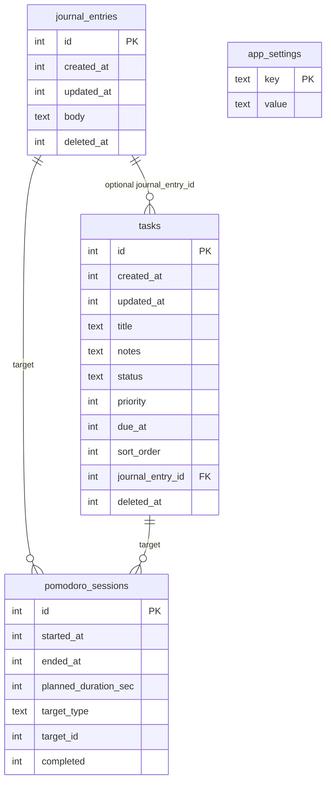

# Data model

SQLite **schema version 6** at runtime (`PRAGMA user_version = 6`). Canonical SQL: [`schema.sql`](schema.sql).

**Runtime file:** `<chosen_folder>/improvement.db`.

**Bootstrap (before SQLite opens):** [`scripts/app/app_config.gd`](../scripts/app/app_config.gd) reads/writes `user://app_config.json` with `db_directory` (absolute path). After open, `app_settings.db_directory` mirrors the path for in-app use.

## Entity relationship

## Tables

### `journal_entries`

Timeline posts. **Soft delete:** `deleted_at` set to Unix seconds, or `NULL` if active.

| Column | Notes |
|--------|--------|
| `body` | Only text field (v3; legacy `title` removed) |
| `created_at` / `updated_at` | Unix UTC seconds; shown in UI |
| `deleted_at` | NULL = visible |

**Default sort:** `created_at DESC` (newest first), configurable via `app_settings.journal_sort_newest_first`.

### `tasks`

Task list. Optional `journal_entry_id` links to a journal entry.

| Column | Notes |
|--------|--------|
| `status` | `pending`, `in_progress`, `done`, `cancelled` |
| `priority` | `0` none … `3` high (strip color in UI) |
| `due_at` | Unix seconds, NULL if unset |
| `sort_order` | Manual list order |
| `deleted_at` | Soft delete |

**Default sort:** Active tasks first (`status != done`), then `sort_order ASC`, then `created_at DESC`. Completed tasks are kept at the bottom while they remain for the current local day.

**End of day:** On the first run each local calendar day, tasks with `status = done` and `updated_at` before today’s local midnight are soft-deleted (`app_settings.task_cleanup_day_key` tracks the last cleanup day).

**Pomodoro integration:** Work is stored in `pomodoro_sessions`, not on the row. Starting a timer on a **pending** task sets `status` to `in_progress`. Rows show **total work time**; tooltip shows **completed pomodoro** count.

### `pomodoro_sessions`

Work intervals for journal or task targets.

| Column | Notes |
|--------|--------|
| `started_at` / `ended_at` | Unix UTC; `ended_at` NULL while running |
| `planned_duration_sec` | Default **1500** (25 min) |
| `completed` | `1` if timer finished; `0` if stopped early |
| `target_type` | `none`, `journal`, `task` |
| `target_id` | FK when set |

#### Pomodoro work tracking (computed)

Per task (`target_type = 'task'`):

| Metric | Rule |
|--------|------|
| **Completed pomodoros** | `COUNT(*)` where `completed = 1` |
| **Total work time** | `SUM(ended_at - started_at)` for rows with `ended_at` set |

UI replaces the old `P0` label with `TimeFormat.format_work_duration(total_work_sec)`.

**API:** `Database.fetch_task_pomodoro_work_stats()` / `fetch_task_pomodoro_work_stats_map()`; `TaskService.get_work_stats()` / `get_work_stats_map()`.

#### Daily work stats (aggregated)

The journal pane shows a daily metrics row ([`scenes/journal/journal_daily_metrics_row.tscn`](../scenes/journal/journal_daily_metrics_row.tscn)) summarising one local calendar day of pomodoro activity. The aggregation runs across **both** `journal` and `task` targets in `pomodoro_sessions` filtered by `started_at` within `[day_start_unix, day_start_unix + 86400)`.

| Metric | Rule |
|--------|------|
| `total_work_sec` | `SUM(ended_at - started_at)` over ended sessions |
| `completed_pomodoros` | `COUNT(*)` where `completed = 1` |
| `session_count` | `COUNT(*)` over all sessions started in the day |
| `journal_work_sec` | `total_work_sec` restricted to `target_type = 'journal'` |
| `task_work_sec` | `total_work_sec` restricted to `target_type = 'task'` |
| `hourly_work_sec` | 24-element `PackedInt32Array`; seconds of work bucketed by local hour |

**API:** `Database.fetch_daily_pomodoro_stats(day_anchor_unix)` → `Dictionary`; `PomodoroService.get_daily_work_stats(day_start_unix)` → [`DailyWorkStats`](../scripts/models/daily_work_stats.gd).

### `app_settings`

| Key | Default | Purpose |
|-----|---------|---------|
| `db_directory` | from setup | Absolute folder containing `improvement.db` |
| `ui_scale` | `1.0` | Stored override for `UiScaleDetector` (applied at startup in `main.gd`) |
| `journal_sort_newest_first` | `true` | Timeline direction |
| `window_width`, `window_height`, `window_x`, `window_y`, `window_mode` | — | Desktop window layout (`WindowLayout`) |

### `tags`

Shared optional labels for journal entries and tasks. Names are unique case-insensitively.

| Column | Notes |
|--------|--------|
| `name` | Display name (`COLLATE NOCASE`) |
| `created_at` | Unix UTC seconds |

**Junction tables:** `journal_entry_tags`, `task_tags` (many-to-many). Assignments replaced wholesale on save.

**Filter-ready queries:** `Database.fetch_journal_entries(..., filter_tag_ids)` and `Database.fetch_tasks(..., filter_tag_ids)` return rows matching **any** selected tag (OR semantics).

## GDScript models

| Resource | Script |
|----------|--------|
| `JournalEntry` | [`scripts/models/journal_entry.gd`](../scripts/models/journal_entry.gd) |
| `TaskItem` | [`scripts/models/task_item.gd`](../scripts/models/task_item.gd) |
| `Tag` | [`scripts/models/tag.gd`](../scripts/models/tag.gd) |
| `PomodoroSession` | [`scripts/models/pomodoro_session.gd`](../scripts/models/pomodoro_session.gd) |

Factory: `*.from_row(dict)` after SQLite queries via [`db_row.gd`](../scripts/database/db_row.gd).

## Services (autoloads)

| Autoload | Role |
|----------|------|
| `AppSetup` | First-run folder UI (not in DB) |
| `Database` | Connection, migrations, SQL, settings |
| `WindowLayout` | Window bounds → `app_settings` |
| `JournalService` | Journal CRUD + search + signals |
| `TaskService` | Task CRUD + reorder + work stats + signals |
| `TagService` | Tag catalog + entry/task assignments + signals |
| `PomodoroService` | Timer + DB sessions + `in_progress` on first task start + daily work stats |
| `SoundService` | Plays feedback sound on completed pomodoro (listens to `PomodoroService.session_ended`) |

**Rule:** UI calls **services**, not `Database`, except bootstrap/low-level cases.

### JournalService

- `list_entries(limit, offset)`, `get_entry`, `create_entry`, `save_entry`, `delete_entry`
- `search(query)` — `LIKE` on `body`
- Signals: `entry_created`, `entry_updated`, `entry_deleted`

### TaskService

- `list_tasks`, `get_task`, `create_task`, `save_task`, `set_status`, `delete_task`
- `get_work_stats`, `get_work_stats_map`
- `move_task_relative_to` (drag reorder)
- Signals: `task_created`, `task_updated`, `task_deleted`, `task_stats_changed`, `task_reordered`

### PomodoroService

- `start_for`, `pause`, `resume`, `stop`, `attach_target`
- Signals: `state_changed`, `session_ended`

## Migrations

| Version | Change |
|---------|--------|
| **1** | Initial tables |
| **2** | Remove legacy `mood` (rebuild if present) |
| **3** | Remove `title`; body-only journal entries |
| **4** | Tags + junction tables for journal entries and todos |
| **5** | Rename `todos` → `tasks`, `todo_tags` → `task_tags` |
| **6** | Pomodoro `target_type`: `'todo'` → `'task'` (rebuild CHECK) |
| **7+** | Add `_migrate_to_vN()`; never edit shipped migration SQL in place |

## Not in v1

- Encryption at rest  
- App-level cloud sync (folder sync via Dropbox is a deployment choice)  
- FTS5  
- Attachments / blobs  
